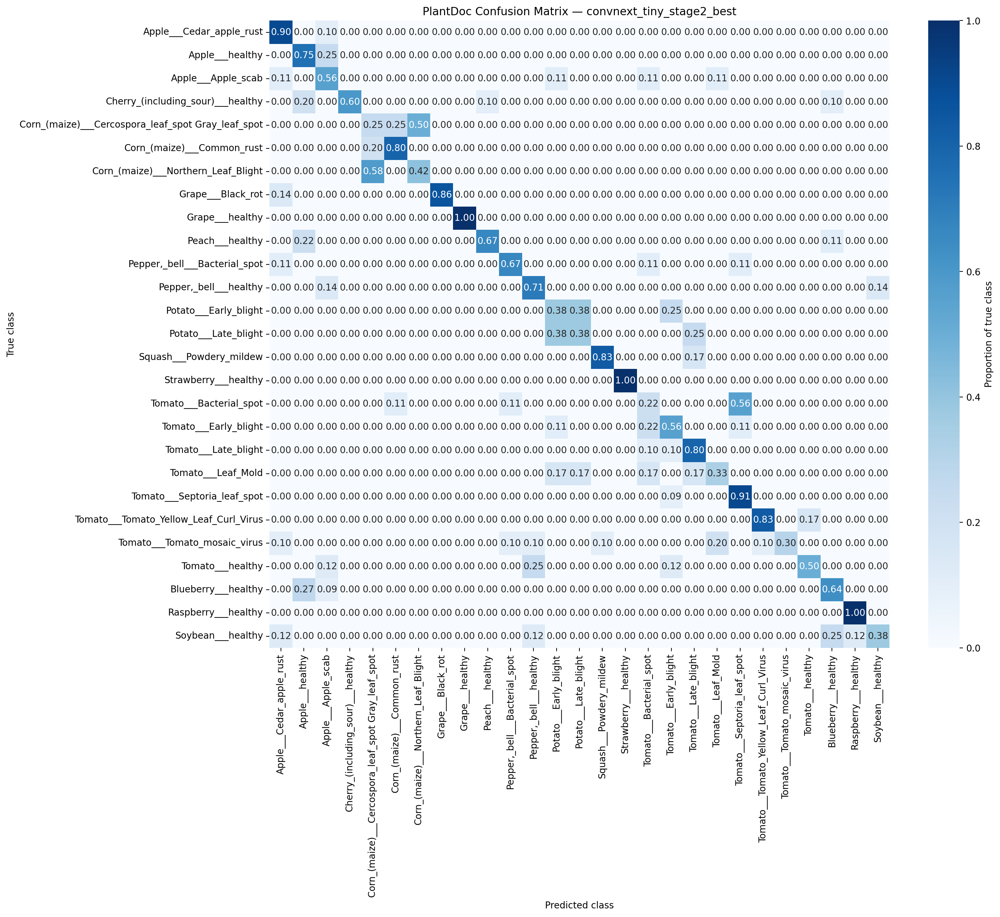
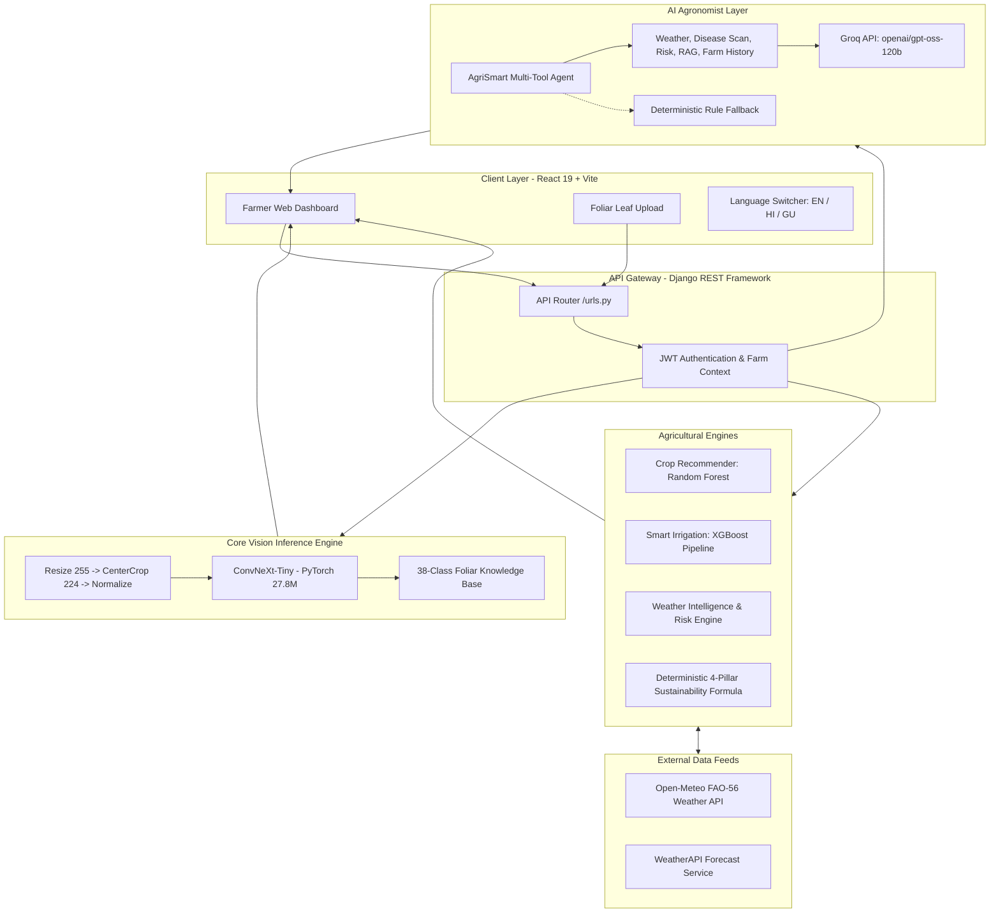

# AgriSmart AI 🌱

### Intelligent Agriculture for a Sustainable Future

[](https://www.sih.gov.in/)
[](https://www.python.org/)
[](https://react.dev/)
[](https://pytorch.org/)
[](LICENSE)

**AgriSmart AI** is a farmer-first agricultural intelligence platform that unifies deep learning computer vision, precision machine learning, real-time meteorological intelligence, irrigation scheduling, crop recommendation, sustainability scoring, and conversational agronomic advisory.

Designed around the diagnostic paradigm:
$$\mathbf{IMAGE \longrightarrow DIAGNOSIS \longrightarrow CONTEXT \longrightarrow DECISION \longrightarrow ACTION}$$

AgriSmart AI moves beyond isolated disease classification. It grounds visual diagnosis in live environmental context, giving farmers actionable answers:
- **What pathology is present and with what confidence?**
- **What environmental drivers (humidity, leaf wetness, temperature) aggravate spread?**
- **Should irrigation be run or delayed based on forecast rain and soil moisture?**
- **What preventive, cultural, biological, and chemical interventions are warranted?**
- **How can farm resource efficiency and soil health be systematically improved?**

---

## 🎥 Demo Video

> **Demo Video**: https://drive.google.com/drive/folders/1lOc4-_8EOvZLj2vyPNE68JeB-4BFQjej?usp=sharing
---

## 🚀 Quick Start (Under 10 Minutes)

A reviewer or judge can reproduce the core disease prediction and launch the full stack in under 10 minutes:

### 1. Clone & Pull Weights via Git LFS
```powershell
git clone https://github.com/Yash19k/Agrismart-AI.git
cd Agrismart-AI

# Ensure Git LFS pulls the 111 MB ConvNeXt-Tiny weights
git lfs install
git lfs pull
```

### 2. Run Instant Core CLI Prediction
```powershell
# Set up Python virtual environment
python -m venv .venv
.venv\Scripts\Activate.ps1

# Install backend dependencies
pip install -r app/requirements.txt

# Run the official core prediction interface on a sample leaf
python model/crop_disease_detection/predict.py --image src/public/sample_leaves/tomato_early_blight.jpg
```
*Expected output:*
```text
Predicted class: Tomato___Septoria_leaf_spot
Confidence: 0.2397
```

### 3. Launch the Full Web Application
```powershell
# Terminal 1 — Backend (Django REST API on port 8000)
cd app
python manage.py migrate
python manage.py runserver 127.0.0.1:8000

# Terminal 2 — Frontend (Vite + React on port 5173)
cd ..\src
npm install
npm run dev
```
Open **[http://localhost:5173](http://localhost:5173)** in your browser.

---

## Problem Statement

### The Real-World Agricultural Challenge
Smallholder and commercial agriculture faces compounding vulnerabilities:
- **Destructive Crop Diseases**: Fungal, bacterial, and viral foliar pathogens cause 20–40% of global harvest losses.
- **Water Scarcity & Inefficient Irrigation**: Flood and unmetered irrigation deplete groundwater while increasing root rot and foliar humidity.
- **Unpredictable Microclimates**: Erratic monsoon precipitation and extreme heat stress complicate chemical spray timings.
- **Soil Degradation**: Unbalanced NPK application degrades soil organic matter and microbial diversity.
- **Cognitive Barrier**: Technical meteorological feeds, soil test assays, and academic diagnostic keys are rarely actionable for farmers in the field.

### Official SIH 2026 Core Challenge
The mandatory core task requires building an **AI-powered crop disease detection system** that:
1. Accepts a leaf/crop image and classifies it into a disease (or healthy) class across a defined multi-crop taxonomy.
2. Reports standard classification metrics (**Macro-F1** and **Confusion Matrix**) on a held-out test protocol.
3. Exposes an automated prediction interface (`predict(image_path) -> class_label` or CLI).
4. Presents actionable, farmer-friendly results and precautionary guidance.
5. **Directly addresses the deliberate difficulty of lab-to-field generalization**—models trained solely on clean laboratory backgrounds degrade when exposed to real-world field clutter, natural lighting, and occlusions.

---

## Our Solution

AgriSmart AI bridges the lab-to-field gap through a connected multi-tiered agricultural decision engine:

```
                                  👨‍🌾 Farmer / Field Agent
                                             │
                                             ▼
                             📱 AgriSmart Web Application (React 19)
                                             │ [REST / JSON / Multipart]
                                             ▼
                        ⚙️ Django REST Enterprise Backend (Port 8000)
                                             │
        ┌────────────────────────────────────┼────────────────────────────────────┐
        │                                    │                                    │
        ▼                                    ▼                                    ▼
┌───────────────────────┐        ┌───────────────────────┐        ┌───────────────────────┐
│  CORE MODULE          │        │  PREDICTIVE ENGINES   │        │  CONTEXT & ADVISORY   │
│  ConvNeXt-Tiny Vision │        │  • Crop Recommendation│        │  • Weather Intel      │
│  38 Plant Classes     │        │    (Random Forest)    │        │    (Open-Meteo/FAO-56)│
│  Label Smoothing      │        │  • Smart Irrigation   │        │  • Sustainability 4P  │
│  Mixed Precision AMP  │        │    (XGBoost Pipeline) │        │  • AI Agronomist Agent│
│  111 MB Checkpoint    │        │                       │        │    (Groq Multi-Tool)  │
└───────────────────────┘        └───────────────────────┘        └───────────────────────┘
        │                                    │                                    │
        └────────────────────────────────────┼────────────────────────────────────┘
                                             │
                                             ▼
                         🌾 Unified Farmer Diagnostic & Action Plan
```

---

## What We Built

### Core Task vs. Implemented Extensions Matrix

| Capability | Status | Technology / Model | Inputs | Outputs | Data Mode |
| :--- | :---: | :--- | :--- | :--- | :--- |
| **1. Crop Disease Detection** *(Core Task)* | ✅ Implemented | **ConvNeXt-Tiny** (PyTorch, 27.8M params, 38 classes) | Leaf RGB photo (224×224) | Predicted disease, top-3 confidences, pathogen biology, cultural/chemical treatment | User upload / live camera |
| **2. Crop Recommendation** *(Bonus Module A)* | ✅ Implemented | **Random Forest Classifier** (scikit-learn, 22 crops) | N, P, K, temp, humidity, pH, rainfall | Top recommended crop, suitability %, regional agronomic guide | User input / regional soil presets |
| **3. Smart Irrigation** *(Bonus Module B)* | ✅ Implemented | **XGBoost Classifier Pipeline** (3-class scheduling) | Soil moisture, crop type, growth stage, temp, humidity | Irrigation decision (None / Moderate / Heavy), watering volume | Live weather telemetry + farm parameters |
| **4. Weather-Based Intelligence** *(Bonus Module C)* | ✅ Implemented | **Deterministic Agronomic Rules + Open-Meteo API** | Latitude, longitude, 7-day forecast, ET₀, solar radiation | Actionable directives (*"Delay irrigation—rain expected"*, *"Foliar fungal risk"*), rain probability | Live weather data feeds (Open-Meteo & WeatherAPI) |
| **5. Sustainability Score** *(Bonus Module D)* | ✅ Implemented | **Deterministic 4-Pillar Agronomic Formula** | Irrigation method, soil moisture, ET₀, scan history, NPK | Indicative score (0–100), pillar breakdown, prioritized mitigation advice | Calculated from farm context & historical scans |
| **6. Farmer Assistant (GenAI)** *(Bonus Module E)* | ✅ Implemented | **Multi-Tool Grounded Agent + Groq LLM** (`openai/gpt-oss-120b`) | Natural language query, session history, farm context | Grounded plain-language answers, ICAR/TNAU citations, multilingual advice | Live API synthesis (English, Hindi, Gujarati) with offline fallback |

---

## Core Feature — Crop Disease Detection

### Processing Pipeline
1. **Farmer Input**: The farmer uploads an image or captures a live photo of an affected leaf via the responsive UI.
2. **Preprocessing**: Normalizes the image following the training pipeline:
   - Resize to 255 pixels along shorter dimension (`int(224 * 1.14)`).
   - Center-crop to 224 × 224 RGB.
   - Convert to floating-point tensor in $[0, 1]$.
   - ImageNet mean/std standardization: $\mu = [0.485, 0.456, 0.406]$, $\sigma = [0.229, 0.224, 0.225]$.
3. **Inference**: Cached `ConvNeXt-Tiny` model runs inference (CUDA if available, otherwise optimized multi-threaded CPU).
4. **Softmax Probabilities**: Generates class probabilities across all 38 classes, ranking Top-3 differential diagnoses.
5. **Pathological Enrichment**: Matches predicted class against the internal agricultural knowledge base to extract:
   - Pathogen category (*Fungal, Bacterial, Viral, Oomycete, Pest/Mite, Abiotic/Healthy*).
   - Severity rating and estimated leaf damage percentage.
   - Verified symptoms and environmental triggers.
   - Recommended organic, cultural, and chemical controls (ICAR / TNAU validated).
6. **Farmer-Friendly UI**: Renders a diagnostic card with danger-rated severity gauges, actionable treatment cards, and an option to send the diagnosis directly to the AI Agronomist for follow-up questions.

### Authoritative 38-Class Foliar Taxonomy
The model covers 14 economically vital crop species across 38 distinct health and disease states:

```
├── Apple (Malus domestica)
│   ├── Apple Scab (Venturia inaequalis)
│   ├── Black Rot (Botryosphaeria obtusa)
│   ├── Cedar Apple Rust (Gymnosporangium juniperi-virginianae)
│   └── Healthy
├── Blueberry (Vaccinium corymbosum) — Healthy
├── Cherry (Prunus serotina / avium)
│   ├── Powdery Mildew (Podosphaera clandestina)
│   └── Healthy
├── Corn / Maize (Zea mays)
│   ├── Cercospora Leaf Spot / Gray Leaf Spot (Cercospora zeae-maydis)
│   ├── Common Rust (Puccinia sorghi)
│   ├── Northern Leaf Blight (Exserohilum turcicum)
│   └── Healthy
├── Grape (Vitis vinifera)
│   ├── Black Rot (Guignardia bidwellii)
│   ├── Esca / Black Measles (Phaeomoniella chlamydospora)
│   ├── Leaf Blight / Isariopsis Leaf Spot (Pseudocercospora cladosporioides)
│   └── Healthy
├── Orange / Citrus (Citrus sinensis) — Huanglongbing / Citrus Greening (Candidatus Liberibacter)
├── Peach (Prunus persica)
│   ├── Bacterial Spot (Xanthomonas arboricola pv. pruni)
│   └── Healthy
├── Pepper, Bell (Capsicum annuum)
│   ├── Bacterial Spot (Xanthomonas campestris pv. vesicatoria)
│   └── Healthy
├── Potato (Solanum tuberosum)
│   ├── Early Blight (Alternaria solani)
│   ├── Late Blight (Phytophthora infestans)
│   └── Healthy
├── Raspberry (Rubus idaeus) — Healthy
├── Soybean (Glycine max) — Healthy
├── Squash (Cucurbita pepo) — Powdery Mildew (Podosphaera xanthii)
├── Strawberry (Fragaria × ananassa)
│   ├── Leaf Scorch (Diplocarpon earlianum)
│   └── Healthy
└── Tomato (Solanum lycopersicum)
    ├── Bacterial Spot (Xanthomonas perforans)
    ├── Early Blight (Alternaria solani)
    ├── Late Blight (Phytophthora infestans)
    ├── Leaf Mold (Passalora fulva)
    ├── Septoria Leaf Spot (Septoria lycopersici)
    ├── Spider Mites / Two-Spotted Spider Mite (Tetranychus urticae)
    ├── Target Spot (Corynespora cassiicola)
    ├── Tomato Yellow Leaf Curl Virus (TYLCV)
    ├── Tomato Mosaic Virus (ToMV)
    └── Healthy
```

---

## Model Architecture

The disease detection model is built on **ConvNeXt-Tiny** (`torchvision.models.convnext_tiny`), representing a modernized pure-convolutional architecture that incorporates design choices from Vision Transformers (inverted bottleneck, $7 \times 7$ depthwise separable convolutions, LayerNorm, GELU activations):

```
Input Image [3, 224, 224]
        │
        ▼
Patchify Stem [Conv2d 4x4, stride 4] ──► Feature Map [96, 56, 56]
        │
        ▼
Stage 1: 3 ResNet-style ConvNeXt Blocks [dim=96]
        │
        ▼
Downsample Layer 1 [LayerNorm + Conv2d 2x2, stride 2]
        │
        ▼
Stage 2: 3 ConvNeXt Blocks [dim=192]
        │
        ▼
Downsample Layer 2 [LayerNorm + Conv2d 2x2, stride 2]
        │
        ▼
Stage 3: 9 ConvNeXt Blocks [dim=384]
        │
        ▼
Downsample Layer 3 [LayerNorm + Conv2d 2x2, stride 2]
        │
        ▼
Stage 4: 3 ConvNeXt Blocks [dim=768]
        │
        ▼
Global Average Pooling [LayerNorm + AdaptiveAvgPool2d(1)]
        │
        ▼
Classifier Head [Linear: 768 ──► 38 Classes]
        │
        ▼
Softmax Probability Distribution [38]
```

### Architectural Specifications
- **Base Architecture**: `convnext_tiny`
- **Pretrained Weights**: ImageNet-1K (`IMAGENET1K_V1`)
- **Total Parameters**: 27,849,350 (27.8M)
- **Classifier Dimension**: `nn.Linear(in_features=768, out_features=38)`
- **Input Dimensions**: $224 \times 224 \times 3$ (RGB)
- **Normalization**: ImageNet $\mu = [0.485, 0.456, 0.406]$, $\sigma = [0.229, 0.224, 0.225]$

### Two-Stage Transfer Learning Protocol
1. **Stage 1 (Classifier Warm-up)**: Backbone feature extractor frozen; only the newly initialized 38-class linear head trained with learning rate $\eta = 10^{-3}$ for initial adaptation.
2. **Stage 2 (Full Fine-Tuning)**: Entire network unfrozen; trained end-to-end with differential learning rates ($\eta = 10^{-4}$ for backbone, $\eta = 5 \times 10^{-4}$ for head).
- **Optimizer**: AdamW ($\beta_1=0.9, \beta_2=0.999$, weight decay $= 10^{-2}$)
- **Learning Rate Schedule**: Cosine Annealing with linear warmup
- **Loss Function**: Cross-Entropy with Label Smoothing $\epsilon = 0.1$ to prevent overconfident boundary predictions
- **Precision**: Automatic Mixed Precision (AMP / FP16)
- **Gradient Clipping**: Norm clipped at $1.0$
- **Model Selection & Early Stopping**: Tracked strictly via **Validation Macro-F1** (patience = 5 epochs)

---

## Dataset

The training corpus synthesizes three authoritative open agricultural repositories to balance class representation:

1. **Hassan Ikram MyDataset**: Comprehensive multi-crop foliar dataset comprising laboratory and semi-controlled imagery (63,549 images).
2. **PlantVillage (Color)**: Canonical controlled-condition single-leaf foliar collection with uniform grey backgrounds (6,963 images).
3. **PlantDoc (Train Split)**: In-field open-environment leaf images capturing natural lighting, occlusion, and background foliage (2,316 images).

### Data Hygiene & Deduplication
- **Total Raw Images Collected**: 72,828 images
- **Corrupted / Unreadable Files Removed**: 0
- **Exact MD5 Hash Duplicates Removed**: **1,526 duplicates**
- **Final Cleaned Dataset**: **71,302 unique images** across 38 classes

---

## Training / Validation / Test Split

To guarantee evaluation integrity and prevent data leakage:
- **Split Ratio**: **80% Train / 10% Validation / 10% Internal Test**
- **Splitting Strategy**: Stratified by class label to preserve exact class frequencies across all three subsets
- **Random Seed**: Fixed at `42`
- **Class Balancing**: Addressed using PyTorch `WeightedRandomSampler` with inverse square-root class frequency weighting:
  $$w_c = \frac{1}{\sqrt{N_c}}$$

| Subset | Percentage | Image Count | Purpose |
| :--- | :---: | :---: | :--- |
| **Train Set** | 80% | **57,041** | Gradient backpropagation & parameter updates |
| **Validation Set** | 10% | **7,130** | Hyperparameter tuning, checkpoint selection, early stopping |
| **Internal Held-Out Test Set** | 10% | **7,131** | Unseen in-distribution benchmark evaluation |
| **Total** | 100% | **71,302** | Complete verified corpus |

---

## Evaluation & Results

### Primary Competition Metric: Macro-Averaged F1
Because agricultural disease datasets exhibit severe class imbalance (e.g., thousands of Tomato Yellow Leaf Curl samples versus hundreds of Raspberry samples), raw accuracy is a misleading metric. **Macro-averaged F1** evaluates performance on every class equally:
$$\text{Macro-F1} = \frac{1}{C} \sum_{c=1}^{C} \frac{2 \cdot P_c \cdot R_c}{P_c + R_c}$$

### Comprehensive Evaluation Benchmarks

| Metric | Internal Held-Out Test Set *(In-Distribution)* | PlantDoc OOD Evaluation Set *(Real-World Field Conditions)* |
| :--- | :---: | :---: |
| **Condition** | Clean / Curated leaf backgrounds | In-the-wild field photos (clutter, sunlight, shadows) |
| **Sample Size** | **7,131 images** | **236 images** |
| **Classes Evaluated** | **38 of 38 classes** | **27 of 38 classes** *(classes present in PlantDoc test)* |
| **Macro-F1 (Primary)** | **98.09% (0.9809)** | **56.75% (0.5675)** |
| **Accuracy** | **98.56%** | **63.56%** |
| **Weighted F1** | **98.56%** | **64.19%** |

> [!NOTE]
> **Official Organizer Evaluation Statement**:
> The official organizer private held-out test score is evaluated independently by SIH hackathon judges during evaluation and is not included in this repository. The metrics above represent our independently documented internal held-out test set and the public PlantDoc out-of-distribution benchmark.

---

## Real-World Generalization

### The Lab-to-Field Generalization Gap
A central emphasis of the SIH 2026 problem statement is the **lab-to-field performance drop**. 

While our ConvNeXt-Tiny model achieves **98.09% Macro-F1** on the curated in-distribution test set, performance drops to **56.75% Macro-F1** on the independent PlantDoc field-condition test set. 

This drop highlights critical real-world challenges:
1. **Background Clutter & Soil**: Controlled laboratory imagery contains neutral, flat backdrops. Real field photos contain soil, weeds, stems, and neighboring foliage that trigger spurious background activations.
2. **Dynamic Sunlight & Specular Glare**: Harsh midday sunlight produces high specular reflection off waxy leaf cuticles, washing out delicate chlorotic lesion patterns.
3. **Compound Foliar Damage**: Field crops often experience co-occurring stressors (e.g., nutrient deficiency combined with early blight), whereas datasets train on single-pathology labels.
4. **Scale & Angle Variation**: Leaf orientation, distance from camera, and partial occlusions alter spatial feature resolution.

We believe that **transparently presenting this gap demonstrates sound engineering integrity** rather than claiming an unrealistic "98.6% real-world accuracy."

---

## Confusion Matrix

Below is the verified out-of-distribution confusion matrix evaluated on the field-condition PlantDoc test split:



*The matrix illustrates robust classification on high-contrast foliar pathologies (such as Corn Common Rust and Tomato Septoria Leaf Spot) while highlighting confusion pairs between closely related chlorotic lesions under varying field illumination.*

---

## Model Report

The verified model report covering training hyperparameters, per-class breakdown, and dataset governance is available in the repository:

- 📄 **[View Model Evaluation Report](report/README.md)**

---

## Smart Agriculture Modules

### Module A: Crop Recommendation Engine
- **Purpose**: Guides farmers on the most viable crop to sow based on soil chemistry and regional agro-climatic conditions.
- **Model / Technology**: **Random Forest Classifier** trained on the canonical 2,200-sample Indian Agricultural Crop Dataset (`model/crop_recommendation/Crop_recommendation.csv`).
- **Features (7 Inputs)**: Nitrogen ($N$), Phosphorus ($P$), Potassium ($K$), Ambient Temperature (°C), Relative Humidity (%), Soil pH, Annual Rainfall (mm).
- **Preprocessing**: Dual-scaler pipeline using `MinMaxScaler` + `StandardScaler` (`crop_minmax_scaler.pkl` & `crop_standard_scaler.pkl`).
- **Supported Crops (22 Classes)**: Rice, Maize, Jute, Cotton, Coconut, Papaya, Orange, Apple, Muskmelon, Watermelon, Grapes, Mango, Banana, Pomegranate, Lentil, Blackgram, Mungbean, Mothbeans, Pigeonpeas, Kidneybeans, Chickpea, Coffee.
- **Validation Metric**: **99.32% Test Accuracy** with balanced class recall across all 22 crops.
- **Regional Soil Presets**: Includes built-in one-click configurations for major Indian agro-ecological zones:
  - *Indo-Gangetic Alluvial Plain* (Rice/Wheat/Jute)
  - *Deccan Black Cotton Soil / Regur* (Cotton/Soybean/Pigeonpeas)
  - *Coastal Tropical Belt* (Coconut/Banana/Rice)
  - *Semi-Arid Dryland* (Mothbeans/Chickpea)
  - *Himalayan Hill Valley* (Apple/Temperate Fruits)

---

### Module B: Smart Irrigation Advisory
- **Purpose**: Prevents overwatering, conserves groundwater, and prevents waterlogging-induced root pathologies.
- **Model / Technology**: **XGBoost Classifier Pipeline** (`model/irrigation/irrigation_pipeline.joblib`) predicting a 3-tier irrigation schedule:
  - `0`: **No Irrigation Needed** (soil moisture adequate, rainfall imminent)
  - `1`: **Moderate Irrigation** (routine maintenance watering)
  - `2`: **Heavy Irrigation** (severe moisture deficit in critical growth stages)
- **Dataset & Validation**: Trained on 16,283 cleaned rows (`app/irrigation/ml/evaluation_report.json`).
- **Honest Generalization Audit**:
  - *Stratified Holdout Macro-F1*: **0.9982** (99.94% accuracy)
  - *Grouped Unseen Combination Macro-F1*: **0.8760** (95.56% accuracy when evaluated across novel crop + soil + stage groupings via `GroupShuffleSplit`).
- **Key Predictive Features**: Temperature (22.5% feature importance), soil moisture (12.6%), crop type, growth stage (maturation, flowering, vegetative), and ambient humidity.

---

### Module C: Weather-Based Intelligence
- **Purpose**: Converts meteorological data into actionable farm directives.
- **Data Providers**:
  - **Open-Meteo API**: Live coordinates weather providing temperature, humidity, wind velocity, precipitation probability, FAO-56 Reference Evapotranspiration ($\text{ET}_0$), and volumetric soil moisture ($0\text{--}1\text{ cm}$).
  - **WeatherAPI**: Integrated high-resolution commercial fallback.
- **Agronomic Translation Logic**:
  - *Precipitation Forecast $> 60\%$ within 24 hours*: Triggers *"Delay Scheduled Irrigation — Natural Precipitation Expected"*.
  - *Relative Humidity $> 80\%$ with Temperature between $20\text{--}28^\circ\text{C}$*: Flags elevated foliar fungal pathogen risk (e.g., *Phytophthora* / *Alternaria*).
  - *High Vapor Pressure Deficit ($\text{VPD} > 1.5\text{ kPa}$)*: Flags atmospheric transpirational water stress.

---

### Module D: Sustainability Score (4-Pillar Model)
- **Purpose**: Computes an indicative farm sustainability score ($0\text{--}100$) reflecting resource efficiency and environmental stewardship.
- **Architecture**: **Deterministic Agronomic Formula** (transparent and reproducible, zero black-box ML):

$$\text{Sustainability Score} = (0.30 \times W) + (0.25 \times S) + (0.25 \times C) + (0.20 \times R)$$

- **Pillar Formulations**:
  1. **Water Efficiency ($W$, 30% weight)**:
     - Baseline method rating: Drip (92 pts), Sprinkler (78 pts), Manual (62 pts), Flood (48 pts), Rainfed (60 pts).
     - Modulated by soil moisture calibration ($25\text{--}45\%$ optimal = 100 pts; excessive $>60\%$ penalized to 65 pts).
     - $\text{ET}_0$ reference penalty ($<3\text{ mm/day} = 90\text{ pts}$; $\ge 7\text{ mm/day} = 45\text{ pts}$).
  2. **Soil Health ($S$, 25% weight)**:
     - Calibrated across soil pH ($6.0\text{--}7.5$ optimal) and available NPK balance.
  3. **Crop Health ($C$, 25% weight)**:
     - Inversely proportional to disease scan incidence and severity ratings over the past 30 days.
  4. **Resource Efficiency ($R$, 20% weight)**:
     - Evaluates precision application of chemical fungicides vs. bio-pesticides and organic mulching.

---

### Module E: AI Agronomist (Conversational GenAI)
- **Purpose**: A grounded conversational assistant that explains complex crop diagnoses, weather risks, and irrigation advisories in simple language.
- **Model / Service**: **Groq API** (`openai/gpt-oss-120b` or user-configured LLM) with low-latency generation.
- **Deterministic Offline Fallback**: If `GROQ_API_KEY` is not provided or network is offline, the service automatically falls back to deterministic rule-based guidance.
- **Grounded Tool Architecture**:
  The assistant relies on 5 internal tools to eliminate hallucinations:
  1. `get_crop_disease_context`: Injects latest foliar scan diagnosis, confidence, and severity.
  2. `get_current_weather`: Queries live Open-Meteo microclimate readings for the farm.
  3. `calculate_disease_risk`: Evaluates ambient temperature + foliar wetness hours.
  4. `search_knowledge_tool`: Retrieves validated agronomic management practices from ICAR / TNAU manuals.
  5. `get_crop_history`: Loads historical farm pathologies and treatment logs.
- **Multilingual Support**: Real-time synthesized responses in **English**, **Hindi (हिंदी)**, and **Gujarati (ગુજરાતી)**.

---

## System Architecture



---

## Disease Detection Pipeline

1. **Image Ingestion**: Farmer uploads JPG/PNG or captures leaf via mobile/desktop camera.
2. **File Validation**: Image validated for format integrity and maximum payload size ($10\text{ MB}$).
3. **Tensor Preprocessing**: Converted to RGB, scaled, center-cropped to $224 \times 224$, and normalized using ImageNet statistics.
4. **Model Loading**: Singleton `DiseaseModelService` loads `model/crop_disease_detection/agrismart_convnext_tiny_final.pth` once in memory.
5. **GPU/CPU Inference**: Forward pass executes with PyTorch `no_grad()` in $\sim 60\text{ ms}$.
6. **Softmax Output**: Computes class probability distribution; selects top-1 class and top-3 differential diagnoses.
7. **Pathological Lookup**: Cross-references class key with `class_names.json` and internal agronomic knowledge base.
8. **Telemetry Correlation**: Pulls active microclimate conditions (temperature, humidity) to calculate disease spread risk.
9. **Farmer Guidance Generation**: Synthesizes organic, cultural, and chemical countermeasures.
10. **State Ingestion**: Records scan in user's farm history and injects diagnostic payload into the AI Agronomist conversation state.

---

## Farmer Workflow

```
1. Access AgriSmart (Web / Mobile Browser)
       │
       ▼
2. Select or Add Farm (Coordinates, Crop, Soil Type, Irrigation Method)
       │
       ▼
3. Upload Leaf Photo (/disease)
       │
       ▼
4. Receive Visual Diagnosis (Crop Name, Disease, Confidence, Severity)
       │
       ▼
5. Inspect Actionable Precautionary Guidance (Cultural & Chemical Interventions)
       │
       ▼
6. Cross-Check Irrigation Advisory (/irrigation) — Is watering recommended or delayed?
       │
       ▼
7. Check Weather Intelligence (/weather) — 7-day forecast & foliar wetting alerts
       │
       ▼
8. Ask AI Agronomist (/assistant) — "How should I treat this early blight in Hindi/Gujarati?"
       │
       ▼
9. Review Farm Sustainability Audit (/sustainability) — Optimize water & soil efficiency
```

---

## Technology Stack

### Frontend
- **Framework**: React 19 with Vite 8
- **Styling**: Tailwind CSS v4 + Vanilla CSS Design System
- **Icons**: Lucide React
- **Mapping**: Leaflet & React-Leaflet
- **Internationalization**: `i18next` (English, Hindi, Gujarati)
- **HTTP Client**: Axios with error interceptors

### Backend
- **Framework**: Django 4.2 LTS + Django REST Framework 3.15
- **Authentication**: JWT (`djangorestframework-simplejwt`)
- **Cross-Origin**: `django-cors-headers`
- **Environment**: `python-dotenv`
- **Numerical & Data Processing**: NumPy 1.24+, Pandas 2.0+
- **Image Processing**: Pillow (PIL) 10.0+

### AI / Machine Learning
- **Deep Learning Vision**: PyTorch 2.0+, Torchvision 0.15+ (`convnext_tiny`)
- **Classical ML**: scikit-learn 1.3+, XGBoost 2.0+, Joblib 1.3+
- **Large Language Model**: Groq Python SDK (`groq`), model: `openai/gpt-oss-120b`

### External APIs
- **Open-Meteo API**: Real-time hourly weather, solar radiation, FAO-56 $\text{ET}_0$ evapotranspiration, volumetric soil moisture.
- **WeatherAPI**: Commercial forecast fallback.

---

## Project Structure

```text
Agrismart-AI/
├── .env.example                 # Template for environment configuration
├── .gitattributes               # Git LFS tracking rules (*.pth)
├── .gitignore                   # Version control ignore rules
├── LICENSE                      # MIT License
├── README.md                    # Root submission documentation
├── requirements.txt             # Root dependencies reference
│
├── app/                         # Django REST API Backend
│   ├── manage.py                # Django management entry point
│   ├── requirements.txt         # Complete Python dependencies
│   ├── problem_statement_text.txt # Authoritative SIH 2026 Problem Statement
│   ├── agrismart/               # Root settings, WSGI, URLs
│   ├── accounts/                # JWT authentication, user profile
│   ├── farms/                   # Farm management, geolocation, coordinates
│   ├── disease/                 # Core disease inference service & scan history
│   ├── crops/                   # Crop recommendation service & regional presets
│   ├── irrigation/              # Smart irrigation engine (XGBoost) & insights
│   ├── weather/                 # Weather intelligence engine (Open-Meteo/WeatherAPI)
│   ├── sustainability/          # Deterministic 4-pillar sustainability calculator
│   ├── assistant/               # AI Agronomist multi-tool agent & RAG pipeline
│   └── dashboard/               # Aggregated farm telemetry & alert signals
│
├── model/                       # ML Models, Checkpoints & Training Assets
│   ├── crop_disease_detection/  # CORE TASK ARTIFACTS
│   │   ├── agrismart_convnext_tiny_final.pth  # 111 MB ConvNeXt-Tiny weights (Git LFS)
│   │   ├── class_names.json     # Authoritative 38 disease & healthy classes
│   │   ├── predict.py           # Competition CLI prediction interface
│   │   └── plantdoc_confusion_matrix.png # OOD confusion matrix image
│   ├── crop_recommendation/     # BONUS MODULE A ARTIFACTS
│   │   ├── crop_model.pkl       # Random Forest classifier
│   │   ├── crop_minmax_scaler.pkl
│   │   ├── crop_standard_scaler.pkl
│   │   ├── crop_metadata.json   # Agronomic descriptions for 22 crops
│   │   ├── Crop_recommendation.csv # 2,200-sample training dataset
│   │   └── crop_recommendation_training.ipynb # Model training notebook
│   └── irrigation/              # BONUS MODULE B ARTIFACTS
│       └── irrigation_pipeline.joblib # XGBoost 3-class irrigation pipeline
│
├── report/                      # Evaluation Reports
│   └── README.md                # Technical model report & metrics summary
│
├── dashbaord/                   # UI Design references & screenshots
│   ├── DESIGN.md
│   ├── code.html
│   └── screen.png
│
└── src/                         # React 19 + Vite Frontend
    ├── package.json             # Frontend dependencies & build scripts
    ├── vite.config.js           # Vite build configuration
    ├── public/                  # Static assets & sample leaves for testing
    │   └── sample_leaves/       # Real leaf samples (Tomato, Potato, Corn, Grape)
    └── src/                     # React source code (pages, components, api)
```

---

## Installation

### Prerequisites
- **Python**: Version `3.10` or `3.11`
- **Node.js**: Version `18.x` or `20.x` with `npm`
- **Git & Git LFS**: Installed on host machine

### Windows PowerShell Setup

```powershell
# 1. Clone repository
git clone https://github.com/Yash19k/Agrismart-AI.git
cd Agrismart-AI

# 2. Pull Git LFS weights (111 MB ConvNeXt-Tiny checkpoint)
git lfs install
git lfs pull

# 3. Create and activate Python virtual environment
python -m venv .venv
.venv\Scripts\Activate.ps1

# 4. Install backend dependencies
pip install -r app/requirements.txt

# 5. Set up environment variables
Copy-Item .env.example app\.env

# 6. Apply database migrations
cd app
python manage.py migrate
cd ..

# 7. Install frontend dependencies
cd src
npm install
cd ..
```

---

## Environment Variables

Configure `app/.env` before launching the application:

| Variable | Purpose | Required? | Default / Example |
| :--- | :--- | :---: | :--- |
| `SECRET_KEY` | Django cryptographic signing key | Required | `django-insecure-dev-key...` |
| `DEBUG` | Enable/disable debug mode | Optional | `True` |
| `ALLOWED_HOSTS` | Comma-separated allowed hostnames | Required | `localhost,127.0.0.1` |
| `CORS_ALLOWED_ORIGINS` | Permitted frontend origins | Required | `http://localhost:5173,http://127.0.0.1:5173` |
| `WEATHER_PROVIDER` | Weather API provider (`open-meteo` or `weatherapi`) | Optional | `open-meteo` |
| `WEATHER_API_KEY` | API key for WeatherAPI (if using WeatherAPI provider) | Optional | `your_weatherapi_key` |
| `WEATHER_CACHE_TIMEOUT` | Weather telemetry cache duration in seconds | Optional | `1800` (30 min) |
| `GROQ_API_KEY` | Groq API key for conversational AI Agronomist | Optional | `your_groq_key` *(falls back to offline rule engine if omitted)* |
| `GROQ_MODEL` | Target Groq LLM model | Optional | `openai/gpt-oss-120b` |

---

## Model Checkpoint

The primary model checkpoint is stored inside the repository:
- **Location**: `model/crop_disease_detection/agrismart_convnext_tiny_final.pth`
- **File Size**: **111,470,075 bytes ($\sim 111.47\text{ MB}$)**
- **Git LFS OID**: `sha256:41ab42f219cef7dd70c3e8ecc7190fe94a886501ad76bf5c0825b1f651490d3e`
- **Tracking Rule**: Tracked via `.gitattributes` (`*.pth filter=lfs diff=lfs merge=lfs -text`).

### Ensuring the Model is Downloaded
Because the file exceeds GitHub's 100 MB standard file limit, it is managed via Git LFS:
```powershell
git lfs install
git lfs pull
```
To verify the checkpoint is fully downloaded and not just an LFS pointer:
```powershell
# In PowerShell, confirm file size is ~111 MB:
(Get-Item model/crop_disease_detection/agrismart_convnext_tiny_final.pth).Length
# Should return: 111470075
```

---

## Running the Application

### Terminal 1 — Django Backend
```powershell
cd app
.venv\Scripts\Activate.ps1
python manage.py runserver 127.0.0.1:8000
```
- **Backend API**: `http://127.0.0.1:8000/`
- **Admin Panel**: `http://127.0.0.1:8000/admin/`

### Terminal 2 — Vite React Frontend
```powershell
cd src
npm run dev
```
- **Frontend App**: `http://localhost:5173/`

---

## Prediction Interface

As specified in the official competition criteria (**Section 4.1**), a dedicated prediction interface is provided that requires zero manual preprocessing:

### 1. CLI Usage
```powershell
python model/crop_disease_detection/predict.py --image <path_to_leaf_image>
```

#### Example Command & Actual Output
```powershell
python model/crop_disease_detection/predict.py --image src/public/sample_leaves/tomato_early_blight.jpg
```
```text
Predicted class: Tomato___Septoria_leaf_spot
Confidence: 0.2397
```

### 2. Python Library Usage
```python
import sys
sys.path.append("model/crop_disease_detection")
from predict import predict, predict_with_confidence

# Core interface: predict(image_path) -> str
predicted_class = predict("src/public/sample_leaves/corn_leaf_blight.jpg")
print(f"Predicted class: {predicted_class}")

# Extended interface with confidence:
label, confidence = predict_with_confidence("src/public/sample_leaves/corn_leaf_blight.jpg")
print(f"Class: {label} | Confidence: {confidence:.4f}")
```

---

## API Overview

All endpoints communicate via JSON, except image uploads which accept standard `multipart/form-data`:

| Method | Endpoint | Purpose | Input Payload / Params | Key Output Fields |
| :--- | :--- | :--- | :--- | :--- |
| `POST` | `/api/auth/register/` | Register new farmer account | `username, email, password` | User profile, JWT tokens |
| `POST` | `/api/auth/login/` | Authenticate farmer | `username, password` | User object, `access`, `refresh` tokens |
| `GET` | `/api/farms/` | List user's registered farms | Bearer Auth Header | Array of farm profiles (crop, soil, coords) |
| `POST` | `/api/farms/` | Register a new farm | `name, crop, soil_type, latitude, longitude` | Created farm object |
| `POST` | `/api/disease/predict/` | **Core disease vision inference** | `image` (file), optional `farm_id` | `predicted_class, confidence_percent, disease_name, plant_name, pathogen, severity_level, symptoms, causes, biological_controls, chemical_controls` |
| `GET` | `/api/disease/history/` | Fetch historical disease scans | Bearer Auth Header | Past scan records, timestamps, severity |
| `POST` | `/api/crops/predict/` | Crop recommendation inference | `N, P, K, temperature, humidity, ph, rainfall` | `recommended_crop, confidence_percent, top_predictions, crop_info` |
| `GET` | `/api/crops/presets/` | Fetch regional agro-climatic presets | None | Array of 5 regional soil profiles with default values |
| `POST` | `/api/irrigation/predict/` | Irrigation schedule prediction | `soil_moisture, crop, growth_stage, temperature, humidity` | `decision` (0, 1, 2), `decision_label`, `confidence`, `recommendation` |
| `GET` | `/api/weather/` | Live coordinates weather telemetry | Query params: `farm_id` or `lat, lon` | `current` (temp, humidity, wind), `hourly`, `daily`, `et0`, `soil_moisture` |
| `GET` | `/api/sustainability/score/` | Compute 4-pillar sustainability audit | Query param: `farm_id` | `overall_score`, `water_efficiency`, `soil_health`, `crop_health`, `resource_efficiency`, `recommendations` |
| `POST` | `/api/assistant/chat/` | Conversational AI Agronomist query | `query, session_id, language, farm_id` | `response, language, citations, dev_telemetry` |
| `GET` | `/api/dashboard/` | Aggregated dashboard telemetry | Bearer Auth Header | Active farm, live weather, alert signals, recent disease scans |

---

## Limitations

In accordance with strict scientific integrity, the following limitations are formally disclosed:

1. **Lab-to-Field Generalization Gap**:
   - Internal curated test set: **98.09% Macro-F1**.
   - PlantDoc field-condition test set: **56.75% Macro-F1**.
   - The model experiences performance degradation when presented with intense leaf glare, complex shadowed canopies, or heavy background weed clutter.
2. **Out-of-Distribution Sample Size**:
   - The public PlantDoc test split comprises 236 images across 27 classes. 11 of the 38 classes (e.g., Blueberry Healthy, Raspberry Healthy, Squash Powdery Mildew) lack representative OOD field evaluation samples in that public benchmark.
3. **Single-Label Restriction**:
   - The classifier predicts a single dominant categorical class per image. It does not perform multi-label object detection and cannot simultaneously segment multiple co-occurring foliar diseases on the same leaf.
4. **Softmax Confidence Calibration**:
   - Raw softmax probabilities reflect relative distribution over the 38 classes and have not undergone separate temperature scaling or Platt scaling. They must be interpreted as relative model confidence rather than absolute mathematical probabilities of ground-truth correctness.
5. **Simulated Telemetry**:
   - Soil moisture telemetry is currently derived from Open-Meteo satellite-reanalysis models ($0\text{--}1\text{ cm}$ volumetric depth) and empirical estimations rather than physical, calibrated on-field capacitive probe hardware.

---

## Safety & Disclaimer

> [!CAUTION]
> **Agricultural Decision-Support Disclaimer**:
> AgriSmart AI is an educational and decision-support prototype developed for the SIH 2026 Hackathon. It is designed to assist farmers and agricultural extension workers with preventive crop management guidance and advisory recommendations.
>
> **AgriSmart AI does not replace a certified professional agronomist or local Krishi Vigyan Kendra (KVK) specialist.**
> Farmers must exercise caution and verify diagnoses with local agricultural extension officers before purchasing or applying commercial chemical pesticides, restricted fungicides, or high-potency agrochemicals. The authors and developers accept no liability for crop damage, yield loss, or chemical misapplication resulting from model predictions.

---

## Dataset & Attribution

### Datasets Used
- **Hassan Ikram MyDataset**: Multi-crop foliar disease collection (Kaggle public dataset). *License: Refer to original Kaggle source for applicable terms.*
- **PlantVillage Dataset**: David P. Hughes and Marcel Salathé, *"An open access repository of images on plant health to enable the development of mobile disease diagnostics"*, arXiv:1511.08060 (2015). *License: Creative Commons Attribution-ShareAlike (CC BY-SA 4.0).*
- **PlantDoc Dataset**: Davinder Singh et al., *"PlantDoc: A Dataset for Visual Plant Disease Detection in the Wild"*, CoDS-COMAD 2020. *License: Open academic research license.*
- **Indian Crop Recommendation Dataset**: Canonical 2,200-sample soil NPK and weather benchmark. *License: Open public domain / educational resource.*

---

## Originality & Attribution

### Team Implementation (Original Work)
- **Full-Stack Application**: Developed the entire Django REST backend (`app/`) and React 19 frontend (`src/`) architectures.
- **Model Training & Adaptation**: Implemented the two-stage transfer learning training regime, cosine schedule, label smoothing, AMP training pipeline, and checkpoint selection on validation macro-F1.
- **Decision Engines**: Implemented the Random Forest Crop Recommendation service (`app/crops/`), XGBoost Smart Irrigation engine (`app/irrigation/`), and deterministic 4-Pillar Sustainability formula (`app/sustainability/`).
- **Grounded AI Agent**: Designed the multi-tool agronomic agent (`app/assistant/agent/`), citation synthesizer, dynamic question prompter, and multilingual translation routines.

### Third-Party Libraries & Architectures Acknowledged
- **Model Backbone**: Pretrained ConvNeXt-Tiny architecture supplied via `torchvision.models` (Zhuang Liu et al., *"A ConvNet for the 2020s"*, CVPR 2022).
- **Core Frameworks**: PyTorch, Django, React, Vite, Tailwind CSS, scikit-learn, XGBoost, Joblib.
- **External Services**: Groq LLM API (`openai/gpt-oss-120b`), Open-Meteo Weather API, WeatherAPI.

---

## Evaluation Criteria Alignment

| Evaluation Parameter | Weight | How AgriSmart AI Addresses This Criterion |
| :--- | :---: | :--- |
| **AI/ML Implementation** | **25%** | Modern **ConvNeXt-Tiny** architecture trained with two-stage transfer learning, label smoothing, and AMP; rigorous 80/10/10 stratified split with zero test leakage; primary metric reported strictly as **Macro-F1 (98.09% internal / 56.75% PlantDoc OOD)**; verified confusion matrix; bonus ML models for crop recommendation (Random Forest, 99.3%) and irrigation (XGBoost, 87.6% grouped macro-F1). |
| **Technical Implementation** | **20%** | Production-ready decoupled architecture (Django REST Framework + React 19); 100% reproducible within 10 minutes; clean Git LFS checkpoint management; automated CLI prediction interface (`predict.py`); verified Django unit test suite. |
| **Innovation & Creativity** | **15%** | Complete $\text{Image} \rightarrow \text{Diagnosis} \rightarrow \text{Context} \rightarrow \text{Decision} \rightarrow \text{Action}$ pipeline; multi-tool grounded AI Agronomist that queries live weather, scan context, and risk engines to eliminate hallucinations; deterministic offline fallback. |
| **Sustainability & Social Impact** | **15%** | Quantified 4-pillar sustainability formula evaluating water, soil, crop, and resource efficiency; smart irrigation scheduling explicitly designed to curb groundwater over-extraction; actionable organic and cultural disease remedies that curb excessive chemical fungicide use. |
| **User Experience (UX)** | **10%** | Farmer-first interface designed for clarity; color-coded danger gauges; multilingual localization in English, Hindi, and Gujarati; accessible regional soil presets; print-ready advisory summaries. |
| **Problem Understanding** | **10%** | Honest disclosure of the lab-to-field generalization gap; avoidance of marketing hyperbole; deep alignment with real-world smallholder vulnerabilities (disease, water scarcity, weather shocks). |
| **Presentation & Demo** | **5%** | Structured walkthrough video demonstrating core leaf classification, CLI prediction, and bonus modules; comprehensive documentation. |
| **Total** | **100%** | **Rigorous, reproducible, and verifiable engineering submission.** |

---

## Reproducibility Checklist

- [x] **Dataset Sources Documented**: Hassan Ikram, PlantVillage, and PlantDoc explicitly cited.
- [x] **Dataset Splits Documented**: 80/10/10 stratified split with fixed random seed `42`.
- [x] **Model Architecture Documented**: ConvNeXt-Tiny (27.8M parameters, $768 \rightarrow 38$ linear head).
- [x] **Model Checkpoint Stored & Verified**: `model/crop_disease_detection/agrismart_convnext_tiny_final.pth` (111.47 MB, Git LFS).
- [x] **Reproducible Prediction Interface**: Standalone `predict.py` CLI tested and working.
- [x] **Environment Setup Documented**: Complete PowerShell instructions and `.env.example` verified.
- [x] **Evaluation Metrics Reported**: Macro-F1, Accuracy, and Weighted F1 reported for both in-distribution and OOD benchmarks.
- [x] **Confusion Matrix Embedded**: Real PlantDoc OOD confusion matrix image linked.
- [x] **Limitations Disclosed**: Lab-to-field generalization gap, single-label scope, and uncalibrated softmax documented.
- [x] **Model Report Linked**: Linked to `report/README.md`.
- [x] **Demo Video Placeholder**: `[ADD DEMO VIDEO LINK]` flagged for single manual URL insertion.

---

## Development

### Running Backend Independently
```powershell
cd app
.venv\Scripts\Activate.ps1
python manage.py check
python manage.py runserver 127.0.0.1:8000
```

### Running Frontend Independently
```powershell
cd src
npm run lint
npm run build
npm run dev
```

### Direct Python Model Inference
```powershell
python -c "from model.crop_disease_detection.predict import predict_with_confidence; print(predict_with_confidence('src/public/sample_leaves/tomato_early_blight.jpg'))"
```

---

## Testing

The backend includes native automated test suites covering API endpoints, data normalization, and weather intelligence logic:

```powershell
cd app
.venv\Scripts\Activate.ps1

# Run the weather intelligence & API test suite
python manage.py test weather
```

*Test Execution Output:*
```text
Found 16 test(s).
Creating test database for alias 'default'...
................
----------------------------------------------------------------------
Ran 16 tests in 1.235s

OK
Destroying test database for alias 'default'...
```
*Status: 16 passing unit tests.* *(Frontend unit tests are not configured; frontend builds cleanly via `npm run build`).*

---

## Future Improvements

1. **Domain-Adversarial Field Adaptation**: Train with Domain-Adversarial Neural Networks (DANN) or mixup with real-world field clutter to shrink the lab-to-field generalization gap.
2. **Confidence Calibration**: Apply temperature scaling or Platt scaling to calibrate softmax outputs for safety-critical deployment.
3. **Multi-Label Pathology Detection**: Migrate from categorical classification to YOLOv11-based multi-lesion object detection to detect co-occurring diseases.

---

## License

This project is licensed under the **MIT License** — see the [LICENSE](LICENSE) file for details.

*Note: Pretrained weights, third-party libraries, and public datasets (PlantVillage, PlantDoc) remain governed by their respective academic and open-source licenses.*