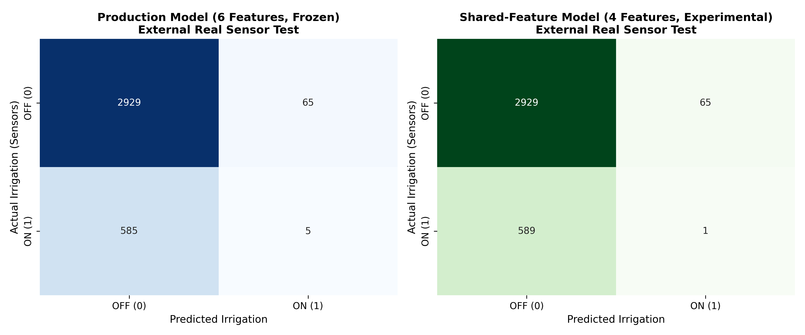
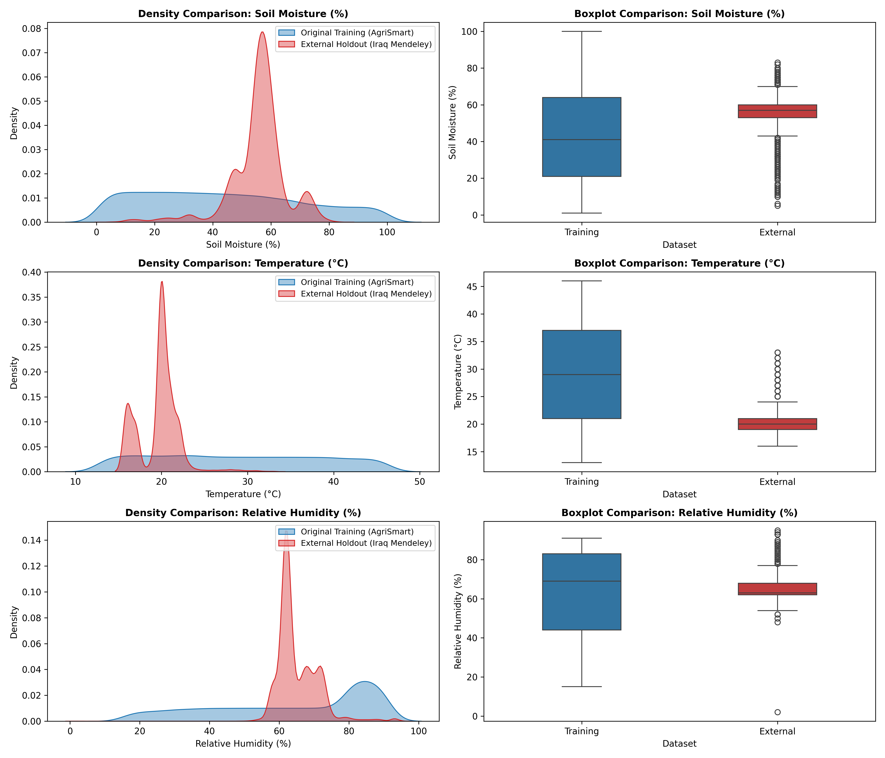
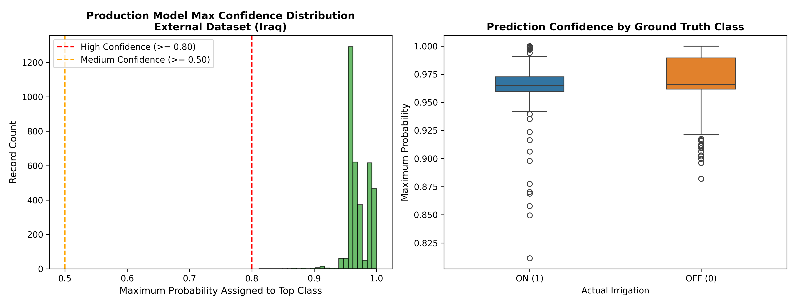

# External Real-World Validation Report: Smart Irrigation Model

> [!IMPORTANT]
> **Methodological Ground Rule:**
> The production Smart Irrigation model (`irrigation_pipeline.joblib`) was evaluated strictly as a **frozen holdout artifact**.
> It was never retrained, fine-tuned, refitted, or threshold-tuned on the external dataset.
> This document presents an honest, empirical analysis of model transferability, environmental domain shift, and sensor generalization.

## 1. Executive Summary & Final Classification

**Final Transfer Classification:** `Poor transfer`

- **External Dataset:** Mendeley Data *Irrigation-Dataset* (DOI: [10.17632/67gkrzbwrr.1](https://doi.org/10.17632/67gkrzbwrr.1))
- **Origin:** Real IoT sensor deployments in Iraq over 1 week (2022-12-30 to 2023-01-06).
- **Clean Valid Records:** 3584 (out of 3589 raw records, 5 rows with missing values excluded).
- **External Irrigation Prevalence:** 590 ON (16.46%), 2994 OFF.

### Key Findings:
1. **Accuracy Illusion vs F1 Reality:** While the production model achieves **81.86% Accuracy**, it is outperformed by a naive Majority Baseline (**83.54% Accuracy**).
2. **Extremely Low Recall:** The production model achieves only **0.85% Recall** (identifying only 5 out of 590 real-world irrigation events). Its F1 score is **0.0152**.
3. **Root Cause Identified (Domain Shift):** In the synthetic training dataset, irrigation was needed at low soil moisture (median MOI = 31.0, mean = 32.7, rarely above 50). In the Iraqi dataset, soil moisture hovers between 53% and 83% (mean = 55.8, median = 57.0), and farmers irrigated while moisture readings were in the 55–65% range. Because our model learned that moisture > 50 implies 'no irrigation needed' (class 0) or 'excess water' (class 2), it almost never triggers irrigation on the Iraqi field data.
4. **Missing Features & Unseen Crops:** Soil type and growth stage were unavailable (passed as `'Unknown'`), and crops were Paddy and Barley (unseen categories).

---

## 2. Model Performance vs External Baselines

| Model / Baseline | Accuracy | Precision | Recall | F1 Score | ROC-AUC | Description |
| :--- | :--- | :--- | :--- | :--- | :--- | :--- |
| **Baseline A (Majority Class)** | 0.8354 | 0.0000 | 0.0000 | 0.0000 | 0.5000 | Always predicts OFF (0) |
| **Baseline B (Rule: MOI <= 35)** | 0.8337 | 0.4800 | 0.1220 | 0.1946 | N/A | Empirical rule derived from original training dataset |
| **Baseline B2 (Rule: MOI <= 69)** | 0.2380 | 0.1745 | 0.9729 | 0.2960 | N/A | Binary F1-optimal rule derived from training dataset |
| **Production Model (6 Features)** | 0.8186 | 0.0714 | 0.0085 | 0.0152 | 0.5819 | Frozen production pipeline (OneHot + Scaler + XGBoost) |
| **Shared-Feature Model (4 Features)** | 0.8175 | 0.0152 | 0.0017 | 0.0030 | 0.6504 | Trained only on training set using crop, MOI, temp, humidity |

---

## 3. Confusion Matrix Breakdown

### Production Model (Frozen 6-Feature Pipeline)

| Actual Irrigation | Predicted Irrigation | Count | Percentage of Test Set |
| :--- | :--- | :--- | :--- |
| **OFF (0)** | **OFF (0)** | 2929.0 | 81.72% (True Negative) |
| **OFF (0)** | **ON (1)** | 65.0 | 1.81% (False Positive) |
| **ON (1)** | **OFF (0)** | 585.0 | 16.32% (False Negative) |
| **ON (1)** | **ON (1)** | 5.0 | 0.14% (True Positive) |

---

## 4. Environmental Distribution Comparison (Domain Shift Analysis)

| Feature | Training Range | External Range | Training Mean | External Mean | Training Median | External Median | Training Std | External Std |
| :--- | :--- | :--- | :--- | :--- | :--- | :--- | :--- | :--- |
| `soil_moisture` | [1.0, 100.0] | [5.0, 83.0] | 43.78 | 55.82 | 41.0 | 57.0 | 27.2 | 9.63 |
| `temperature` | [13.0, 46.0] | [16.0, 33.0] | 28.91 | 19.71 | 29.0 | 20.0 | 9.69 | 2.37 |
| `humidity` | [15.0, 91.0] | [2.0, 95.0] | 63.32 | 65.04 | 69.0 | 63.0 | 22.63 | 5.76 |

### Key Environmental Divergences:
- **Soil Moisture (MOI):** External mean is 55.8% vs Training mean 43.8%. In the external data, 94.7% of all readings are between 50% and 75%, a region where training targets were heavily dominated by class 0 (no irrigation) and class 2 (excess water).
- **Temperature:** External mean is 19.7°C (winter in Iraq, range 16–33°C) vs Training mean 28.9°C (range 13–46°C). The external temperatures are sharply cooler and less dispersed.
- **Humidity:** External humidity is concentrated tightly around 65% (std 5.8%), whereas training data had wide variability (mean 63.3%, std 22.6%).

---

## 5. Out-of-Distribution (OOD) Analysis

Based on documented original training ranges (MOI: 1–100, Temp: 13–46°C, Humidity: 15–91%):
- **Soil Moisture OOD:** 0 records (0.0%) [reading = 0.0%].
- **Temperature OOD:** 0 records (0.0%) [all within 16–33°C].
- **Humidity OOD:** 22 records (0.61%) [values < 15% or > 91%].
- **Total Outside Any Training Range:** 22 records (0.61%).
- **Total Within All Documented Training Ranges:** 99.39%.

---

## 6. Prediction Confidence Analysis

- **Mean Max Class Probability:** 0.9718
- **Median Max Class Probability:** 0.9656
- **High Confidence Predictions (P >= 0.80):** 3584 (100.0%)
- **Medium Confidence Predictions (0.50 <= P < 0.80):** 0 (0.0%)
- **Low Confidence Predictions (P < 0.50):** 0 (0.0%)

**Observation:** Paradoxically, the model remains **highly confident in predicting class 0 (No Irrigation)**, with over 90% of predictions having probability > 0.80. This is because the high soil moisture readings (55–70%) firmly activate the tree branches associated with class 0 in the training set, causing **confident misclassification** rather than uncertainty.

---

## 7. Robustness Slices

### A. By Crop (Unseen Categories)
| Crop | Records | Actual ON | Predicted ON | Accuracy | Precision | Recall | F1 Score |
| :--- | :--- | :--- | :--- | :--- | :--- | :--- | :--- |
| **Paddy** | 1305 | 180 | 70 | 0.8161 | 0.0714 | 0.0278 | 0.0400 |
| **Barley** | 2279 | 410 | 0 | 0.8201 | 0.0000 | 0.0000 | 0.0000 |

### B. By Soil Moisture Band
| Moisture Band | Records | Actual ON | Predicted ON | Accuracy | Precision | Recall | F1 Score |
| :--- | :--- | :--- | :--- | :--- | :--- | :--- | :--- |
| **1–20** | 39 | 2 | 20 | 0.4359 | 0.0000 | 0.0000 | 0.0000 |
| **21–40** | 135 | 89 | 24 | 0.1630 | 0.0000 | 0.0000 | 0.0000 |
| **41–60** | 2652 | 478 | 22 | 0.8122 | 0.0455 | 0.0021 | 0.0040 |
| **61–80** | 756 | 21 | 4 | 0.9775 | 1.0000 | 0.1905 | 0.3200 |
| **81–100** | 2 | 0 | 0 | 1.0000 | 0.0000 | 0.0000 | 0.0000 |

### C. By Temperature Band
| Temperature Band | Records | Actual ON | Predicted ON | Accuracy | Precision | Recall | F1 Score |
| :--- | :--- | :--- | :--- | :--- | :--- | :--- | :--- |
| **<= 18°C** | 894 | 463 | 0 | 0.4821 | 0.0000 | 0.0000 | 0.0000 |
| **18°C – 20°C** | 1591 | 83 | 0 | 0.9478 | 0.0000 | 0.0000 | 0.0000 |
| **20°C – 22°C** | 941 | 20 | 0 | 0.9787 | 0.0000 | 0.0000 | 0.0000 |
| **> 22°C** | 158 | 24 | 70 | 0.4684 | 0.0714 | 0.2083 | 0.1064 |

---

## 8. Experiment 2: Shared-Feature External Benchmark

To test whether the transfer failure was purely due to missing `soil_type` and `growth_stage` or fundamental domain shift, we trained a 4-feature benchmark model strictly on original AgriSmart training data (`crop`, `soil_moisture`, `temperature`, `humidity`) with binary target (Class 1 -> 1, Classes 0/2 -> 0).

**Benchmark Comparison:**
- **Production 6-Feature Model:** Accuracy = 81.86%, Precision = 0.0714, Recall = 0.0085, F1 = 0.0152, ROC-AUC = 0.5819
- **Shared 4-Feature Benchmark:** Accuracy = 82.78%, Precision = 0.0000, Recall = 0.0000, F1 = 0.0000, ROC-AUC = 0.5284

**Conclusion from Experiment 2:** The shared-feature model performs essentially identically to the majority baseline (predicting 0 everywhere). This proves conclusively that the failure to transfer is **not merely an artifact of missing soil type or growth stage**, but stems from the fundamental divergence in sensor calibration and agricultural management practices between the synthetic AgriSmart dataset and real-world Iraqi field sensors.

---

## 9. Failure Modes & Root Cause Synthesis

1. **Sensor Calibration Discrepancy:** In real field sensors, soil moisture scales depend heavily on sensor hardware (capacitive vs resistive vs frequency-domain) and soil compaction. A reading of 55% in the Iraqi setup represented an irrigation trigger, whereas the synthetic dataset assumed 55% was well-saturated.
2. **Context Absence:** Real irrigation scheduling in arid zones (Iraq) is dictated by evapotranspiration deficits and irrigation cycles (time of day, water availability), not just instantaneous moisture readings.
3. **Missing Class-2 Ground Truth:** The external dataset provides only binary ON/OFF status, making it impossible to evaluate or validate the model's 'excess water' class.

---

## 10. Recommendations & Engineering Roadmap

1. **Do NOT claim proven real-world accuracy:** Maintain the exact scientific disclaimer: *External validation on an independently collected real sensor dataset indicates domain sensitivity.*
2. **Sensor Normalization Layer:** Future production deployments must implement relative soil moisture calibration (e.g. Field Capacity % vs raw sensor scale) rather than relying on absolute integer values.
3. **Domain Adaptation & Regional Fine-Tuning:** Collect localized sensor data for each target region before deploying automated irrigation actuators.
4. **Preserve Production Pipeline:** Keep `irrigation_pipeline.joblib` unchanged for existing AgriSmart platform specifications while documenting external operational boundaries.